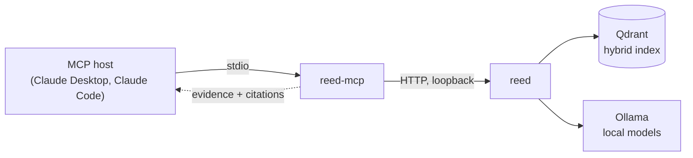

<div align="center">

# reed-mcp

**Your assistant reads your private documents. Nothing leaves the machine.**

An [MCP](https://modelcontextprotocol.io) server that puts
[reed](https://github.com/Ulzuhan/reed) — a local-first RAG service with audited
citations — behind four read-only tools, so any MCP host can answer from your
own documents.

[](https://github.com/Ulzuhan/reed-mcp/actions/workflows/ci.yml)
[](https://www.python.org/)
[](https://docs.astral.sh/ruff/)
[](https://mypy-lang.org/)
[](LICENSE)

</div>

---

## The problem

Connecting an assistant to your documents normally means uploading them
somewhere. For a law firm, a clinic or anyone under GDPR, that is not a
deployment detail — it is the reason the project does not happen.

The pieces to avoid it already exist: local models, local vector stores, RAG
services that run on a laptop. What was missing is the join. An assistant that
can *use* a local index needs a tool interface, and a RAG service that answers
in prose is the wrong shape — the host already has a model, and a better one.
What it needs is **evidence**.

## Constraints

- **Nothing leaves the machine.** The host spawns this server over stdio; the
  server talks to reed over loopback. There is no telemetry, no analytics and no
  third-party host in the request path.
- **The host's model writes the answer.** reed-mcp returns ranked passages with
  filenames, pages and scores. Attribution is the point: an answer nobody can
  check is worse than no answer.
- **Read-only.** No upload, no replace, no delete. A tool that cannot destroy
  anything needs no confirmation dialog and no trust.
- **Consumer hardware.** A laptop, a 4B model, no GPU cluster.

## Architecture



Two decisions carry the design.

**A separate process, not a reed subcommand.** reed is single-node by design:
one process per registry and active index. Importing it as a library while
`reed serve` is running is exactly what that model forbids, so reed-mcp is a
client, and reed's HTTP surface is the contract between them.

**`search` before `ask`.** `reed_search` returns evidence and stops; the host's
model writes the answer and cites it. `reed_ask` runs reed's own local model
instead, which costs seconds rather than milliseconds — worth it when a fully
local generation is the requirement, wasteful when the host was going to write
the answer anyway. This is why reed grew
[`POST /v1/search`](https://github.com/Ulzuhan/reed/issues/36): retrieval
without generation did not exist, and without it every lookup paid for an answer
the caller would discard.

## Tools

| Tool | Returns |
|---|---|
| `reed_search` | Ranked passages: filename, page, section, score, excerpt — plus reed's evidence-threshold verdict (`sufficient_evidence`), reported rather than applied, so the host decides when to abstain. |
| `reed_ask` | reed's own answer with `[n]` markers, its sources, and the result of reed's citation audit. |
| `reed_list_documents` | The corpus and each document's ingestion status. |
| `reed_get_document` | One document's status and metadata. |

## Seeing it work

A real Claude Code session, against a local reed holding one document:

```
$ claude -p "Using the reed tools, what is the expense pre-approval threshold
             and how long do I have to submit receipts? Cite the document."

From `handbook.md` — Acme Remote Work Handbook, "Expenses" section:

- Pre-approval threshold: expenses above €75 require pre-approval from your
  team lead.
- Receipts: must be submitted within 30 days of purchase.

Also in that section: reimbursement is processed on the 15th of the following
month.
```

The model wrote that from what `reed_search` handed it — evidence, not prose:

```json
{
  "sufficient_evidence": true,
  "min_evidence_score": 0.83,
  "sources": [
    {
      "n": 1,
      "filename": "handbook.md",
      "section": "Acme Remote Work Handbook",
      "score": 1.0,
      "excerpt": "## Expenses\n\nExpenses above 75 euros require pre-approval from your team lead. Receipts must…"
    }
  ]
}
```

## Results

Measured end to end — a real MCP session over stdio, a real reed, a real index —
on an Apple M5 (32 GB) running reed 0.5.1 with EmbeddingGemma and qwen3.5:4b
through Ollama. 30 searches and 5 asks after a warm-up call:

| Operation | p50 | p95 |
|---|---|---|
| `reed_search` | 159 ms | 252 ms |
| `reed_ask` (local 4B model writes the answer) | 4.8 s | — |

The gap is the whole argument for `search`: retrieval is thirty times cheaper
than generation, and the host already has a model.

On egress, the honest claim is architectural rather than measured: the only host
reed-mcp opens a connection to is `REED_MCP_URL`, and its runtime dependencies
are `httpx` and the MCP SDK. Independent verification is a job for a tool built
for it — that measurement will be added when
[`egress-audit`](https://github.com/Ulzuhan) exists rather than asserted here.

## Run it

You need a running [reed](https://github.com/Ulzuhan/reed) **0.5.0 or newer**
(`/v1/search` first shipped there; 0.5.1+ recommended) and
[uv](https://docs.astral.sh/uv/).

Claude Code:

```bash
claude mcp add reed -- uvx reed-mcp
```

Claude Desktop, in `claude_desktop_config.json`:

```json
{
  "mcpServers": {
    "reed": {
      "command": "uvx",
      "args": ["reed-mcp"]
    }
  }
}
```

Then ask your assistant something your documents answer. It will search, quote
and cite.

## Configuration

Environment variables only — never tool arguments, so nothing sensitive can be
elicited through the tool channel:

| Variable | Default | Meaning |
|---|---|---|
| `REED_MCP_URL` | `http://localhost:8000` | Where reed listens |
| `REED_MCP_API_KEY` | empty | Sent as `X-API-Key`; set it when reed runs with `REED_API_KEY` |
| `REED_MCP_TIMEOUT_SECONDS` | `120` | Per-request timeout |
| `REED_MCP_MAX_EXCERPT_CHARS` | `2000` | Longer excerpts are truncated and marked `excerpt_truncated` |

## Security model

- **Retrieved text is data, not instructions.** Excerpts reach the host's model
  as quoted document content, and every tool description says so. reed audits
  citations on its side. Neither can semantically sanitise a document: index
  what you trust, and treat a corpus anyone can write to as untrusted input.
- **Credentials never touch the tool channel.** They arrive through the
  process environment and are never logged.
- **Nothing here can modify your corpus.** All four tools are annotated
  read-only, and the server implements no write path.

## Development

```bash
uv sync
uv run pytest
uv run ruff check . && uv run mypy
```

The unit suite is hermetic — reed is stubbed at the HTTP layer. The end-to-end
suite is not, and that is the point: it launches this package the way a host
does and drives it against a real reed. CI runs it against the published reed
image, pinned by digest.

```bash
REED_MCP_E2E_URL=http://localhost:8000 uv run pytest e2e
```

Mocks proved the wiring and missed the bug that mattered — a client bound to an
event loop that had already closed, which broke every tool call in every real
host while the unit suite stayed green. The e2e suite exists because of it.

## License

Apache-2.0.
